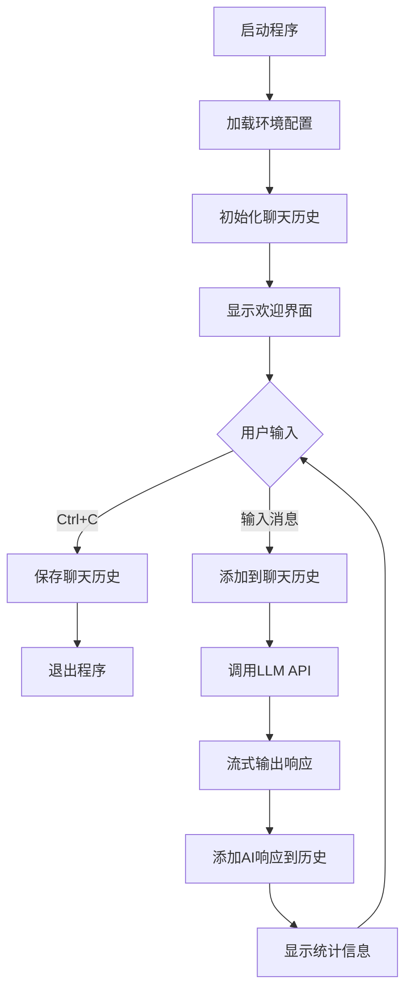
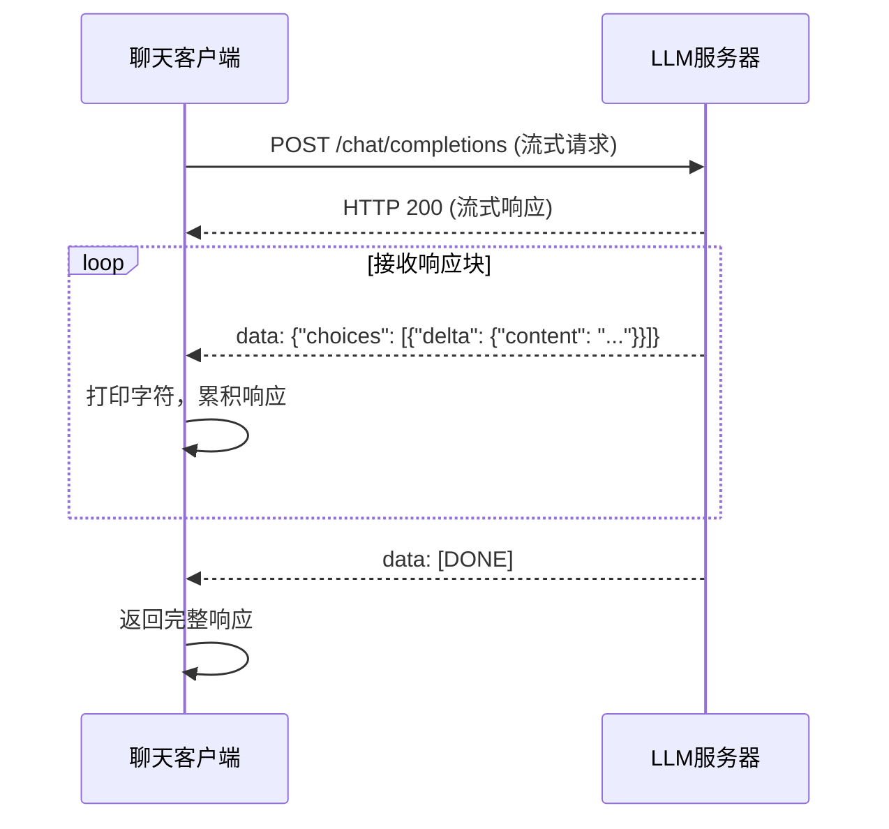

# AI聊天客户端技术规格说明

## 1. 架构设计

### 1.1 整体架构

```
┌─────────────────────────────────────────────────────────────┐
│                     终端聊天界面层                           │
│  ┌─────────────────────────────────────────────────────┐   │
│  │  用户输入 → input()                                  │   │
│  │  AI响应输出 → print() (流式输出)                     │   │
│  │  退出处理 → KeyboardInterrupt异常捕获                 │   │
│  └─────────────────────────────────────────────────────┘   │
├─────────────────────────────────────────────────────────────┤
│                     业务逻辑层                             │
│  ┌─────────────────────────────────────────────────────┐   │
│  │  chat_history: List[dict] - 聊天历史上下文           │   │
│  │  load_env() - 加载环境配置                          │   │
│  │  call_llm() - 调用LLM API                          │   │
│  │  count_tokens() - token计数                         │   │
│  └─────────────────────────────────────────────────────┘   │
├─────────────────────────────────────────────────────────────┤
│                     数据访问层                             │
│  ┌─────────────────────────────────────────────────────┐   │
│  │  HTTP请求 → http.client                             │   │
│  │  JSON处理 → json模块                                │   │
│  │  文件存储 → chat_history.json                       │   │
│  └─────────────────────────────────────────────────────┘   │
└─────────────────────────────────────────────────────────────┘
```

### 1.2 模块划分

| 模块 | 职责 | 对应文件 |
| :--- | :--- | :--- |
| 环境配置 | 读取.env文件，解析配置参数 | chat_client.py |
| LLM调用 | 构建HTTP请求，处理流式响应 | chat_client.py |
| 聊天管理 | 维护聊天历史，处理用户输入 | chat_client.py |
| 输出格式化 | 格式化显示响应和统计信息 | chat_client.py |

## 2. 数据结构

### 2.1 聊天消息格式

```python
{
    "role": str,        # "system" | "user" | "assistant"
    "content": str      # 消息内容
}
```

### 2.2 环境配置结构

| 配置项 | 类型 | 默认值 | 说明 |
| :--- | :--- | :--- | :--- |
| BASE_URL | str | "http://localhost:1234/v1" | LLM API基础URL |
| MODEL | str | "" | 模型名称 |
| API_KEY | str | "lm-studio" | API密钥 |
| TEMPERATURE | float | 0.7 | 温度参数 |
| MAX_TOKENS | int | 1000 | 最大响应token数 |

## 3. 核心流程

### 3.1 主流程



### 3.2 LLM调用流程



## 4. API接口

### 4.1 外部API（LLM服务）

| 接口 | 方法 | 路径 |
| :--- | :--- | :--- |
| 聊天完成 | POST | /chat/completions |

请求体结构：
```json
{
    "model": "模型名称",
    "messages": [{"role": "...", "content": "..."}],
    "temperature": 0.7,
    "max_tokens": 1000,
    "stream": true
}
```

响应结构（流式）：
```json
{
    "choices": [
        {
            "delta": {
                "content": "响应片段"
            }
        }
    ]
}
```

### 4.2 内部函数接口

| 函数名 | 功能 | 参数 | 返回值 |
| :--- | :--- | :--- | :--- |
| load_env() | 加载环境变量 | 无 | dict |
| call_llm() | 调用LLM API | messages, base_url, model, api_key, temperature, max_tokens | str |
| count_tokens() | 估算token数量 | text: str | int |

## 5. 部署与集成

### 5.1 依赖

- Python 3.12+
- 标准库：http.client, json, os, time, urllib.parse

### 5.2 配置文件

.env文件格式：
```
BASE_URL=http://localhost:1234/v1
MODEL=your-model-name
API_KEY=lm-studio
TEMPERATURE=0.7
MAX_TOKENS=1000
```

### 5.3 启动方式

```bash
python chat_client.py
```

## 6. 错误处理

| 错误类型 | 处理方式 |
| :--- | :--- |
| .env文件不存在 | 提示用户复制env.example并配置 |
| LLM连接失败 | 显示错误信息，继续等待下一次输入 |
| JSON解析失败 | 忽略无效响应块 |
| KeyboardInterrupt | 保存聊天历史，优雅退出 |