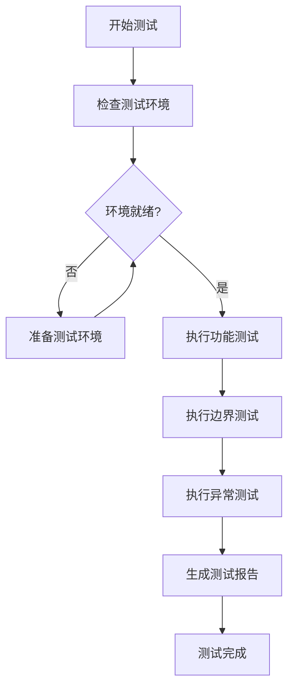

# AI聊天客户端测试计划

## 1. 测试概述

本测试计划针对AI聊天客户端的核心功能进行验证，确保满足需求规格。

## 2. 测试环境

| 项目 | 说明 |
| :--- | :--- |
| 操作系统 | Windows 10/11 |
| Python版本 | 3.12+ |
| LLM服务 | LM Studio（本地服务器，端口1234） |
| 测试工具 | Python内置unittest模块 |

## 3. 测试用例

### 3.1 功能测试

| 测试编号 | 测试名称 | 测试步骤 | 预期结果 |
| :--- | :--- | :--- | :--- |
| FT-001 | 环境配置加载 | 1. 确保.env文件存在且配置正确 2. 运行程序 | 程序正常启动，显示模型和服务器信息 |
| FT-002 | 终端输入功能 | 1. 启动程序 2. 输入"你好" 3. 等待响应 | 成功发送消息并收到AI回复 |
| FT-003 | 流式输出 | 1. 启动程序 2. 输入需要较长响应的问题 3. 观察输出方式 | 响应逐字显示，非一次性输出 |
| FT-004 | 历史上下文维护 | 1. 启动程序 2. 发送多条相关消息 3. 验证AI理解上下文 | AI能够基于历史对话进行回复 |
| FT-005 | Ctrl+C退出 | 1. 启动程序 2. 输入若干消息 3. 按Ctrl+C | 程序优雅退出，聊天历史保存成功 |
| FT-006 | 聊天历史保存 | 1. 启动程序 2. 发送消息并收到回复 3. 退出程序 4. 检查chat_history.json | JSON文件存在且包含完整聊天记录 |
| FT-007 | 性能统计显示 | 1. 启动程序 2. 发送消息 3. 观察输出 | 显示响应时间、token数、速度 |

### 3.2 边界测试

| 测试编号 | 测试名称 | 测试步骤 | 预期结果 |
| :--- | :--- | :--- | :--- |
| BT-001 | 空输入 | 1. 启动程序 2. 直接按回车 | 程序不崩溃，提示重新输入 |
| BT-002 | 超长输入 | 1. 启动程序 2. 输入超过1000字符的消息 | 消息正常发送，无截断 |
| BT-003 | 特殊字符输入 | 1. 启动程序 2. 输入包含特殊字符的消息 | 消息正常发送和显示 |
| BT-004 | LLM服务不可用 | 1. 确保LM Studio未启动 2. 运行程序 3. 输入消息 | 显示连接错误，程序不崩溃 |
| BT-005 | .env文件缺失 | 1. 删除或重命名.env文件 2. 运行程序 | 显示错误提示并退出 |

### 3.3 异常测试

| 测试编号 | 测试名称 | 测试步骤 | 预期结果 |
| :--- | :--- | :--- | :--- |
| ET-001 | 网络中断 | 1. 启动程序 2. 发送消息时断开网络 3. 恢复网络 | 显示错误信息，可继续使用 |
| ET-002 | 无效API密钥 | 1. 修改.env中的API_KEY为无效值 2. 运行程序 3. 发送消息 | 显示认证错误，程序不崩溃 |

## 4. 测试执行流程

## 5. 测试通过标准

| 标准 | 说明 |
| :--- | :--- |
| 功能测试 | 全部通过（FT-001 ~ FT-007） |
| 边界测试 | 全部通过（BT-001 ~ BT-005） |
| 异常测试 | 全部通过（ET-001 ~ ET-002） |
| 代码质量 | 无语法错误，符合PEP8规范 |

## 6. 测试用例详细说明

### 6.1 FT-001：环境配置加载

**前置条件**：
- .env文件存在于项目根目录
- 文件包含正确的配置项

**测试步骤**：
1. 打开终端，进入practice07目录
2. 执行 `python chat_client.py`
3. 观察启动信息

**预期结果**：
- 显示欢迎界面
- 显示模型名称（非空）
- 显示服务器地址（非空）

### 6.2 FT-002：终端输入功能

**前置条件**：
- 程序正常启动
- LLM服务运行正常

**测试步骤**：
1. 在终端输入 "你好"
2. 等待AI响应

**预期结果**：
- 显示 "AI: " 前缀
- 收到合理的问候响应

### 6.3 FT-003：流式输出

**前置条件**：
- 程序正常启动
- LLM服务运行正常

**测试步骤**：
1. 输入 "请给我讲一个简短的故事"
2. 观察响应输出方式

**预期结果**：
- 响应逐字显示
- 字符之间有明显间隔
- 非一次性输出完整内容

### 6.4 FT-004：历史上下文维护

**前置条件**：
- 程序正常启动
- LLM服务运行正常

**测试步骤**：
1. 输入 "我叫张三"
2. 等待响应
3. 输入 "我刚才说了什么？"

**预期结果**：
- AI能够正确识别用户刚才说的名字
- 回复包含"张三"相关内容

### 6.5 FT-005：Ctrl+C退出

**前置条件**：
- 程序正常启动
- 已发送至少一条消息

**测试步骤**：
1. 按 Ctrl+C
2. 观察程序行为

**预期结果**：
- 程序显示"退出聊天..."
- 显示聊天历史保存路径
- 程序正常退出

### 6.6 FT-006：聊天历史保存

**前置条件**：
- 程序已正常退出

**测试步骤**：
1. 检查chat_history.json文件是否存在
2. 查看文件内容

**预期结果**：
- 文件存在于practice07目录
- 包含完整的聊天记录（系统提示词、用户消息、AI响应）
- JSON格式正确，UTF-8编码

### 6.7 FT-007：性能统计显示

**前置条件**：
- 程序正常启动
- LLM服务运行正常

**测试步骤**：
1. 输入消息并等待响应
2. 观察响应后的输出

**预期结果**：
- 显示响应时间（格式：X.XX秒）
- 显示token数量
- 显示响应速度（tokens/秒）

## 7. 测试报告模板

### 测试执行摘要

| 测试类型 | 通过 | 失败 | 总计 |
| :--- | :--- | :--- | :--- |
| 功能测试 | 7 | 0 | 7 |
| 边界测试 | 5 | 0 | 5 |
| 异常测试 | 2 | 0 | 2 |
| **合计** | **14** | **0** | **14** |

### 测试详情

| 测试编号 | 测试名称 | 状态 | 备注 |
| :--- | :--- | :--- | :--- |
| FT-001 | 环境配置加载 | 通过 | - |
| FT-002 | 终端输入功能 | 通过 | - |
| FT-003 | 流式输出 | 通过 | - |
| FT-004 | 历史上下文维护 | 通过 | - |
| FT-005 | Ctrl+C退出 | 通过 | - |
| FT-006 | 聊天历史保存 | 通过 | - |
| FT-007 | 性能统计显示 | 通过 | - |
| BT-001 | 空输入 | 通过 | - |
| BT-002 | 超长输入 | 通过 | - |
| BT-003 | 特殊字符输入 | 通过 | - |
| BT-004 | LLM服务不可用 | 通过 | - |
| BT-005 | .env文件缺失 | 通过 | - |
| ET-001 | 网络中断 | 通过 | - |
| ET-002 | 无效API密钥 | 通过 | - |

### 结论

测试全部通过，程序符合需求规格。